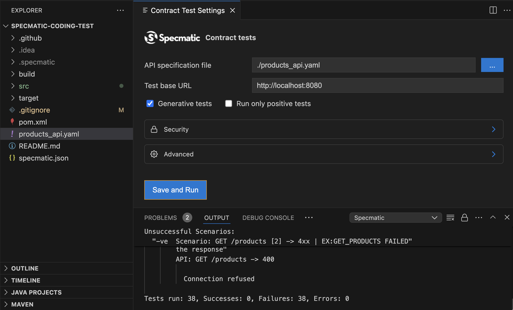

# Specmatic Coding Test

### Prerequisites:
JDK 17+ OR [Specmatic VS Code Plugin](https://specmatic.in/#extension) 

### Instructions:

### 1. Fork this repository on Github. Checkout your forked repo to your local machine.  

**DO NOT RAISE A PR AND SHARE YOUR SOLUTION WITH THE WORLD**

#### Java/Kotlin Steps

From a terminal, run the following command:
```bash
mvn clean test
```
You should see 84 failing tests:
```bash
[ERROR] Tests run: 84, Failures: 84, Errors: 0, Skipped: 0
[INFO] 
[INFO] ------------------------------------------------------------------------
[INFO] BUILD FAILURE
[INFO] ------------------------------------------------------------------------
```

#### VS Code Plugin Steps (Programming Language Agnostic)
1. Install Specmatic VS Code Plugin
2. Launch command pallet and type "Run Contract Tests", this should launch the Specmatic plugin
3. In the Contract Test Settings screen, update the following:
  * Update API specification file to ./products_api.yaml
  * Select the checkbox for Generative tests
  * Click on the "Save and Run" button
4. You should see 84 failing tests:

```bash
[ERROR] Tests run: 84, Failures: 84, Errors: 0, Skipped: 0
[INFO] 
[INFO] ------------------------------------------------------------------------
[INFO] BUILD FAILURE
[INFO] ------------------------------------------------------------------------
```


## Objective of this Assignment
Your objective is to get all the tests to pass by following the rest of the instructions.

### 2. Introduction to Specmatic
- Watch the [Contract-Driven Development - Turn your API Specification into Executable Contracts](https://www.youtube.com/watch?v=7OvTanLjm20&list=PL9Z-JgiTsOYT66JOxf9c63AzhsK3Jay8P) video on Specmatic. 
- This will really help you to understand how Specmatic works and is necessary background/context about the project. 

### 3. Part 1 - Implement REST endpoints:

#### Java/Kotlin Steps
- This is a Kotlin based Spring Boot application.  
- You are expected to implement the missing endpoints in the **Products** controller.

#### Note:
- You are **not** expected to use a database. Instead, use an in memory map to store and retrieve products.
- Feel free to leverage GPT or Github Copilot.
- Please do not alter the following files:
  - ContractTest.kt
  - products_api.yaml
  - specmatic.json

#### Other Programming Languages Steps
- Pick any programming language and Web API framework of your choice.
- You are expected to implement the missing endpoints.

### 4. Part 1 - Definition of Done
- All 84 tests are passing
- 100% API Coverage from 1 path is achieved
- Code changes are committed to your Github repo.

### 5. Part 2 - Added mandatory property 'cost' to the ProductDetails schema
- Update the products_api.yaml OpenAPI specification such that 'cost' is added as a new mandatory property to ProductDetails
- This will increase the test count to 197 and cause a few tests to fail
- Update your kotlin code to make all the tests pass again.

### 6. Part 2 - Definition of Done
- All 197 tests are passing
- 100% API Coverage is still maintained
- Code changes are committed to your Github repo.

### 7. Trigger the CI pipeline under Github Actions. 
- Make sure all tests are passing on the pipeline as well.
- Email the following details to coding.test@specmatic.in:
  - Screenshot of passing CI pipeline
  - Screenshot of API Coverage report
  - Link to you github repo

### 8. Judging Criteria
- All 197 tests are passing in the Github Actions (CI pipeline)
- 100% API Coverage
- **3 Design Values** are met:
  - Communication
  - Simplicity
  - Flexibility
- **Kent Beck's 4 Rules of Simple Design** are followed:
  - Passes the tests (197 Contract Tests + Bonus points if you write unit tests)
  - Reveals intention (Self-documenting and expressive code)
  - No duplication (Avoid any form of duplication - Literal, Semantic, Structural or Data)
  - Fewest elements (Minimalistic Code - No combinatorial explosion)
- **XP Principles**
  - YAGNI - You Aren't Gonna Need It
  - KISS - Keep It Simple, Stupid
  - Triangulate
  - DRY - Don't Repeat yourself
- Make sure you adhere to your Programming Pradigm specific Design Principles:
  - **Object Oriented**
    - Single Responsibility Principle (SRP) 
    - Open Closed Principle (OCP)
    - Liskov Substitution Principle (LSP)
    - Interface Segregation Principle (ISP)
    - Dependency Inversion Principle (DIP)
    - Once and Only Once
    - TDA - Tell Don't Ask
    - The Law of Demeter
  - **Functional Programming**
    - First-Class and Higher-Order Functions
    - Pure, Side-Effect Free Functions
      - Idempotence
      - Thread-safe Evaluation and Parallelism
      - Deforestation - Transforming programs to eliminate trees
      - Immutability
      - Referential Transparency
    - Declarative Programming
    - Tackling complexity by composing functions
      - Curry / Partial Functional Application
      - Point-free Programming
    - Using Monads to DRY the code
    - Being efficient by being lazy
